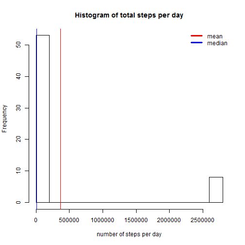
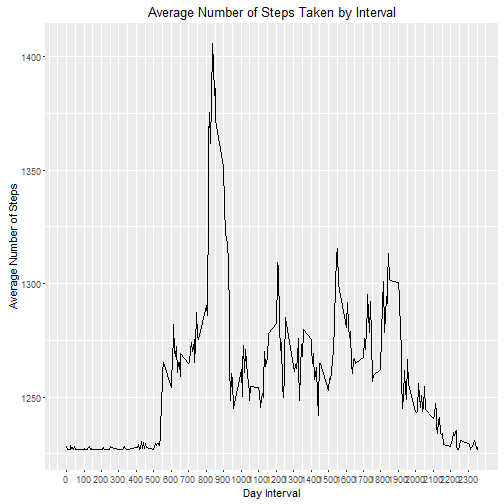

```r
library(dplyr)
library(ggplot2)
library(timeDate)

rm(list = ls()) # clear vars
setwd("C:\\dev\\RepData_PeerAssessment1\\")

activity.data <- read.csv(unz("activity.zip", "activity.csv"), colClasses = c("integer", "Date", "integer"))
activity.data$date <- as.POSIXct(activity.data$date)
```

# Calculate the total number of steps taken per day

 
 ```r
 total.steps <- tapply(activity.data$steps, activity.data$date, FUN = sum, na.rm = TRUE)
 daily.steps <- activity.data %>% group_by(date) %>% summarise(Steps = sum(steps))
 names(daily.steps) <- c("Date", "steps")
 ```

# Mean and median number of steps taken each days
 
 ```r
 mean.daily.steps <- mean(total.steps, na.rm = TRUE)
 median.daily.steps <- median(total.steps, na.rm = TRUE)
 ```

## mean.daily.steps:3.6266808 &times; 10<sup>5</sup>
## median.daily.steps:1.1458 &times; 10<sup>4</sup>

# Histogram of the total number of steps taken each day


```r
hist(daily.steps$steps, breaks = 11,
     xlab = "number of steps per day",
     main = "Histogram of total steps per day")
abline(v = mean.daily.steps, col = "red", lwd = 1)
abline(v = median.daily.steps, col = "blue", lwd = 1)
legend(x = "topright", legend = c("mean", "median"), col = c("red", "blue"), bty = "n", lwd = 3)
```



## What is the average daily activity pattern?

 
 ```r
 activity.interval <- activity.data %>% group_by(interval) %>% summarise(mean_steps = mean(steps, na.rm = TRUE))
 ```

#Time series plot of the average number of steps taken

```r
activity.interval.plot <- ggplot(data = activity.interval, mapping = aes(x = interval, y = mean_steps)) +
    geom_line() + scale_x_continuous("Day Interval", breaks = seq(min(activity.interval$interval),
    max(activity.interval$interval), 100)) + scale_y_continuous("Average Number of Steps") +
ggtitle("Average Number of Steps Taken by Interval")
activity.interval.plot
```



#The 5-minute interval that, on average, contains the maximum number of steps

 
 ```r
 max.steps = activity.interval[activity.interval$mean_steps==which.max(activity.interval$mean_steps)]
 ```
 
 ```
 ## Error: Length of logical index vector must be 1 or 2, got: 288
 ```
 
 ```r
 #max.steps:`r max.steps`
 ```

### Calculate and report the total number of missing values in the dataset (i.e. the total number of rows with NAs)
 
 ```r
 present.days <- na.omit(activity.data$steps)
 missing.days <- length(activity.data$steps) - length(present.days)
 # strategy for filling in missing data (just replace with mean)
 activity.data$steps[is.na(activity.data$steps)] <- mean.daily.steps
 # create a new dataset that is equal to the original dataset but with the missing data filled in.
 strategy <- function(x) { ifelse(is.na(x), mean.daily.steps, x) }    
 activity.data.no.na <- as.data.frame(lapply(activity.data, FUN = strategy))
 ```

# repeat first part of assignment using non NA valued data
# Calculate the total number of steps taken per day

 
 ```r
 total.steps.no.na <- tapply(activity.data.no.na$steps, activity.data.no.na$date, FUN = sum, na.rm = TRUE)
 daily.steps.no.na <- total.steps.no.na %>% group_by(date) %>% summarise(Steps = sum(steps))
 ```
 
 ```
 ## Error in UseMethod("group_by_"): no applicable method for 'group_by_' applied to an object of class "c('array', 'double', 'numeric')"
 ```
 
 ```r
 names(daily.steps.no.na) <- c("Date", "steps")
 ```
 
 ```
 ## Error in names(daily.steps.no.na) <- c("Date", "steps"): object 'daily.steps.no.na' not found
 ```

# Calculate and report the mean and median of the total number of steps taken per day


```r
mean.daily.steps.no.na <- mean(total.steps.no.na, na.rm = TRUE)
median.daily.steps.no.na <- median(total.steps.no.na, na.rm = TRUE)
```

# Histogram of the total number of steps taken each day after missing values are imputed


```r
hist(daily.steps.no.na$steps, breaks = 11,
    xlab = "number of steps per day 2",
    main = "Histogram of total steps per day 2")
```

```
## Error in hist(daily.steps.no.na$steps, breaks = 11, xlab = "number of steps per day 2", : object 'daily.steps.no.na' not found
```

```r
    abline(v = daily.steps.no.na, col = "red", lwd = 1)
```

```
## Error in abline(v = daily.steps.no.na, col = "red", lwd = 1): error in evaluating the argument 'v' in selecting a method for function 'abline': Error: object 'daily.steps.no.na' not found
```

```r
    abline(v = median.daily.steps.no.na, col = "blue", lwd = 1)
```

```
## Error in int_abline(a = a, b = b, h = h, v = v, untf = untf, ...): plot.new has not been called yet
```

```r
    legend(x = "topright", legend = c("mean", "median"), col = c("red", "blue"), bty = "n", lwd = 3)
```

```
## Error in strwidth(legend, units = "user", cex = cex, font = text.font): plot.new has not been called yet
```

#Panel plot comparing the average number of steps taken per 5-minute interval across weekdays and weekends
#https://cran.r-project.org/web/packages/timeDate/index.html

 
 ```r
 activity.data$day.type <- "weekday"
 activity.data$day.type[isWeekend(activity.data$date)] <- "weekend"
 activity.data$day.type <- as.factor(activity.data$day.type)
 ```

# Make a panel plot containing a time series plot (i.e. type = "l") of the 5-minute interval (x-axis) and the average number of steps taken, averaged across all weekday days or weekend days (y-axis). 

```r
pattern <- aggregate(steps ~ interval + day.type, data = activity.data, mean)
library(lattice)
xyplot(steps ~ interval | day.type, pattern, type = "l", layout = c(1, 2), xlab = "Interval", ylab = "Number of steps")
```


##  Calculate average steps of each 5-minutes interval for weekdays and weekend


```r
weekend <- pattern[which(pattern$day.type == "weekend"),] %>% group_by(day.type) %>% summarise(Steps = sum(steps))
weekday <- activity.data[which(activity.data$day.type == "weekday"),]
```
