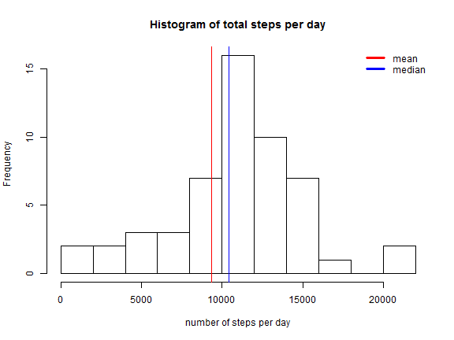

# Reproducible Research: Peer Assessment 1


```r
library(dplyr)
library(ggplot2)
library(timeDate)
```

# Code for reading in the dataset and/or processing the data

```r
rm(list = ls()) # clear vars
setwd("C:\\dev\\RepData_PeerAssessment1\\")
activity.data <- read.csv(unz("activity.zip", "activity.csv"), colClasses = c("integer", "Date", "integer"))
activity.data$date <- as.POSIXct(activity.data$date)
```

# Calculate the total number of steps taken per day

```r
total.steps <- tapply(activity.data$steps, activity.data$date, FUN = sum, na.rm = TRUE)
```

# Mean and median number of steps taken each days

```r
mean.daily.steps <- mean(total.steps, na.rm = TRUE)
median.daily.steps <- median(total.steps, na.rm = TRUE)
```

# mean daily steps = 9354.2295082
# median daily steps = 10395

# Histogram of the total number of steps taken each day

```r
daily.steps <- activity.data %>% group_by(date) %>% summarise(Steps = sum(steps))
names(daily.steps) <- c("Date", "steps")
hist(daily.steps$steps, breaks = 11,
     xlab = "number of steps per day",
     main = "Histogram of total steps per day")
abline(v = mean.daily.steps, col = "red", lwd = 1)
abline(v = median.daily.steps, col = "blue", lwd = 1)
legend(x = "topright", legend = c("mean", "median"), col = c("red", "blue"), bty = "n", lwd = 3)
```



# What is the average daily activity pattern?

```r
activity.interval <- activity.data %>% group_by(interval) %>% summarise(mean_steps = mean(steps, na.rm = TRUE))
activity.interval
```

```
## # A tibble: 288 x 2
##    interval mean_steps
##       <int>      <dbl>
## 1         0  1.7169811
## 2         5  0.3396226
## 3        10  0.1320755
## 4        15  0.1509434
## 5        20  0.0754717
## 6        25  2.0943396
## 7        30  0.5283019
## 8        35  0.8679245
## 9        40  0.0000000
## 10       45  1.4716981
## # ... with 278 more rows
```


# Time series plot of the average number of steps taken

```r
activity.interval.plot <- ggplot(data = activity.interval, mapping = aes(x = interval, y = mean_steps)) +
    geom_line() + scale_x_continuous("Day Interval", breaks = seq(min(activity.interval$interval),
    max(activity.interval$interval), 100)) + scale_y_continuous("Average Number of Steps") +
ggtitle("Average Number of Steps Taken by Interval")
activity.interval.plot
```


# The 5-minute interval that, on average, contains the maximum number of steps


```r
max.steps = activity.interval[which.max(activity.interval$mean_steps),]
```

# Calculate and report the total number of missing values in the dataset (i.e. the total number of rows with NAs)


```r
present.days <- na.omit(activity.data$steps)
missing.days <- length(activity.data$steps) - length(present.days)
missing.days
```

```
## [1] 2304
```

# implement a strategy for filling in missing data by replacing NA values with mean)

```r
activity.data$steps[is.na(activity.data$steps)] <- mean.daily.steps
```

# create a new dataset that is equal to the original dataset but with the missing data filled in.

```r
strategy <- function(x) { ifelse(is.na(x), mean.daily.steps, x) }    
activity.data.filled <- as.data.frame(lapply(activity.data, FUN = strategy))
```


# Calculate the total number of steps taken per day

```r
total.steps.filled <- tapply(activity.data.filled$steps, activity.data.filled$date, FUN = sum, na.rm = TRUE)
summary(total.steps.filled)
```

```
##    Min. 1st Qu.  Median    Mean 3rd Qu.    Max. 
##      41    9819   11460  362700   15080 2694000
```
# Panel plot comparing the average number of steps taken per 5-minute interval across weekdays and weekends
##  https://cran.r-project.org/web/packages/timeDate/index.html

```r
activity.data$day.type <- "weekday"
activity.data$day.type[isWeekend(activity.data$date)] <- "weekend"
activity.data$day.type <- as.factor(activity.data$day.type)
```

# Make a panel plot containing a time series plot (i.e. type = "l") of the 5-minute interval (x-axis) and the average number of steps taken, averaged across all weekday days or weekend days (y-axis). 

```r
pattern <- aggregate(steps ~ interval + day.type, data = activity.data, mean)
library(lattice)
xyplot(steps ~ interval | day.type, pattern, type = "l", layout = c(1, 2), xlab = "Interval", ylab = "Number of steps")
```


##  Calculate average steps of each 5-minutes interval for weekdays and weekend

```r
weekend <- pattern[which(pattern$day.type == "weekend"),] %>% group_by(day.type) %>% summarise(Steps = mean(steps))
weekend
```

```
## # A tibble: 1 x 2
##   day.type    Steps
##     <fctr>    <dbl>
## 1  weekend 1206.972
```

```r
weekday <- pattern[which(pattern$day.type == "weekday"),] %>% group_by(day.type) %>% summarise(Steps = mean(steps))
weekday
```

```
## # A tibble: 1 x 2
##   day.type    Steps
##     <fctr>    <dbl>
## 1  weekday 1277.857
```


